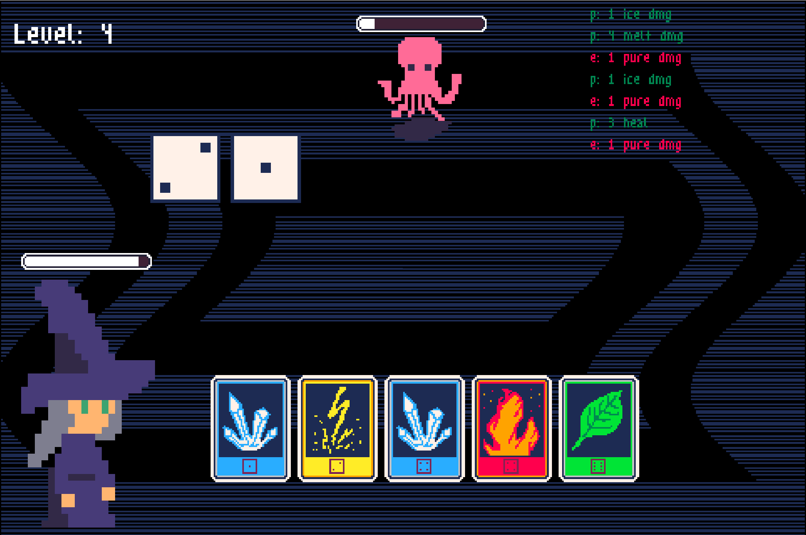
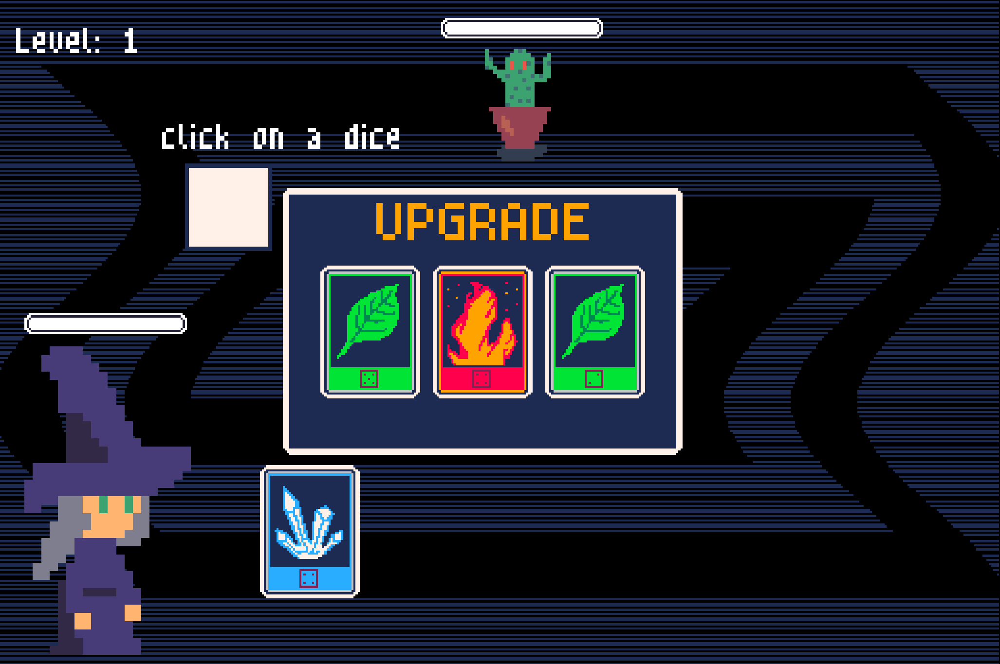

# Wild Magic Dice

> Ludum Dare 59 [submission](https://ldjam.com/events/ludum-dare/59/$428823). Theme: signal.

A little witch sending signals to dices. Hope the Random loves yous. 

Play game in browser: https://catinthedark.itch.io/wild-dice-magic

## Game mechanics

Throw a dice and select the best one to activate cards. Card could heal or damage of 3 elements: ice, fire, electro. If you apply both cards of different elements you'll get damage boost.

Each round you receive an upgrade - a card. Sometimes you get an extra dice.

Each level enemies become stronger.

Current version is endless, you can only loose :) I'd love to get some feedback on how I can improve the mechanics so it'd me fun to play.

## Controls

- Mouse click
- [R] to restart

## NO AI

Code and art were created like in Antient times: manually by hand.

I think Ludum Dare should be a challenge for me.

---

Made for the Omsk Ludum Dare gathering: https://ldjam.com/events/ludum-dare/59/$428823/omsk-ludum-dare-gathering-is-here
